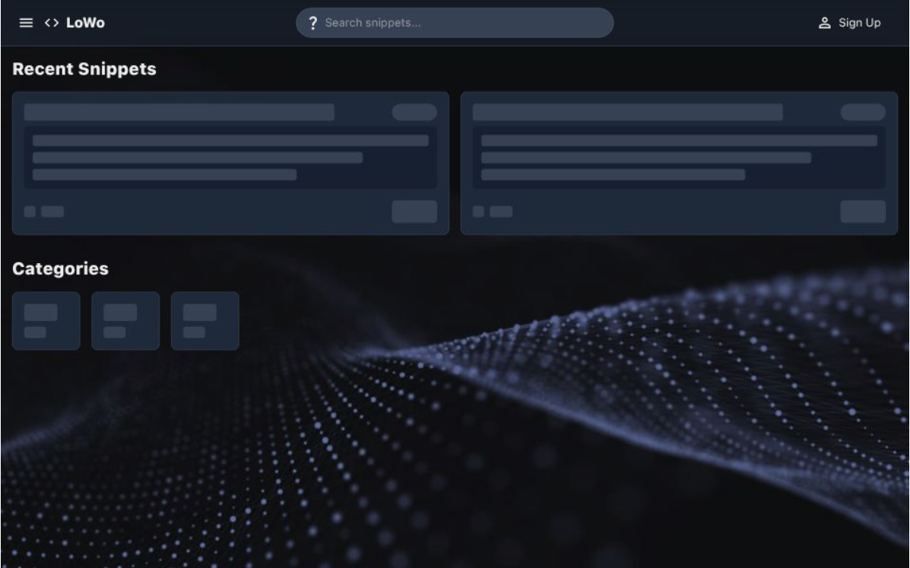

# LOWO - Snippets Made Easy
### Demo: https://lowo-six.vercel.app/signup
> LoWo is a fast, all‑purpose snippet manager for capturing anything, whether it be ideas, reusable code, recipes, or more. Organize with categories, and save snippets from selected text or your clipboard.

WIP
---
1. Ability to attach images
2. AI auto snippet recognition
3. Physical location attachment and recognition

Features
---

> Create different categories for each snippet. Snippets are made up of text, and allow the user to save pieces of text, or code that they may want to reuse or remember in the future

1. Create custom snippets
2. Categorize snippets
3. Select or copy text and click `New` to automatically add it to the snippet. (Context Awareness)
4. Import files with text in order to highlight different sections in order to create new snippets
5. Filter through your snippets however you'd like for quick and easy access
6. Text highlighting for code snippets

---
